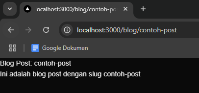
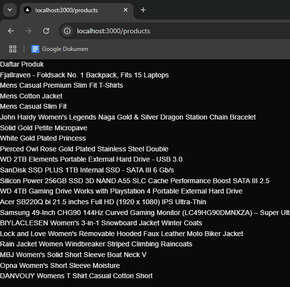
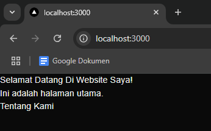
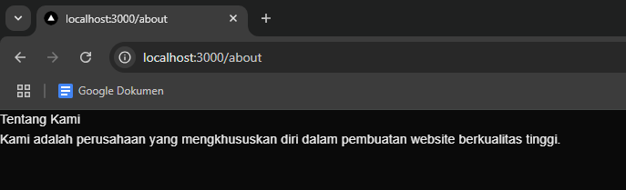
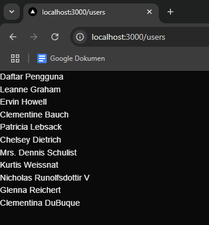
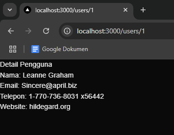
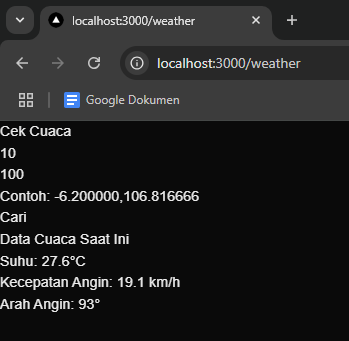

# PERTEMUAN 3 - Pengenalan Next.js

> Nama: Fahridana Ahmad Rayyansyah
>
> Kelas: TI-3A
>
> Absen: 11

<hr />

## Praktikum 1: Persiapan Lingkungan

1. Membuat project next

    

2. Menjalankan aplikasi next

    

## Praktikum 2: Membuat Halaman dengan Server-Side Rendering (SSR)

1. Mengubah file pages/index.tsx

    ```tsx
    import React from "react";

    const HomePage = () => (
    	<div>
    		<h1>Selamat Datang di Website Saya!</h1>
    		<p>Ini adalah halaman utama</p>
    	</div>
    );

    export default HomePage;
    ```

2. Hasil

    

## Praktikum 3: Menggunakan Static Site Generation (SSG)

1. Membuat file baru `blog.js`

    ```js
    import React from "react";

    const Blog = ({ posts }) => {
    	return (
    		<div>
    			<h1>Blog Saya</h1>
    			{posts.map((posts) => (
    				<div key={posts.id}>
    					<h2>{posts.title}</h2>
    					<p>{posts.body}</p>
    				</div>
    			))}
    		</div>
    	);
    };

    export async function getStaticProps() {
    	const res = await fetch("https://jsonplaceholder.typicode.com/posts");
    	const posts = await res.json();

    	return {
    		props: {
    			posts,
    		},
    	};
    }

    export default Blog;
    ```

2. Hasil

    

## Praktikum 4: Menggunakan Dynamic Routes

1. Membuat file baru `blog/[slug].js`

    ```js
    import { useRouter } from "next/router";

    const BlogPost = () => {
    	const router = useRouter();
    	const { slug } = router.query;

    	return (
    		<div>
    			<h1>Blog Post: {slug}</h1>
    			<p>Ini adalah blog post dengan slug {slug}</p>
    		</div>
    	);
    };

    export default BlogPost;
    ```

2. Hasil

    

## Praktikum 5: Menggunakan API Routes

1. Membuat file `pages/api/products.js`

    ```js
    export default async function handler(req, res) {
    	const response = await fetch("https://fakestoreapi.com/products");
    	const products = await response.json();
    	res.status(200).json(products);
    }
    ```

2. Membuat file baru untuk menampilkan product, `pages/products.js`

    ```js
    import { useState, useEffect } from "react";

    const ProductList = () => {
    	const [products, setProducts] = useState([]);

    	useEffect(() => {
    		const fetchProducts = async () => {
    			const response = await fetch("/api/products");
    			const products = await response.json();
    			setProducts(products);
    		};

    		fetchProducts();
    	}, []);

    	return (
    		<div>
    			<h1>Daftar Produk</h1>
    			<ul>
    				{products.map((product) => (
    					<li key={product.id}>{product.title}</li>
    				))}
    			</ul>
    		</div>
    	);
    };

    export default ProductList;
    ```

3. Hasil

    

## Praktikum 6: Menggunakan Link Component

1. Modifikasi file `pages/index.tsx` agar menggunakan link component

    ```tsx
    import React from "react";
    import Link from "next/link";

    const HomePages = () => {
    	return (
    		<div>
    			<h1>Selamat Datang Di Website Saya!</h1>
    			<p>Ini adalah halaman utama.</p>
    			<Link href="/about"> Tentang Kami</Link>
    		</div>
    	);
    };

    export default HomePages;
    ```

2. Membuat file baru `pages/about.js`

    ```js
    const AboutPage = () => {
    	return (
    		<div>
    			<h1>Tentang Kami</h1>
    			<p>
    				Kami adalah perusahaan yang mengkhususkan diri dalam
    				pembuatan website berkualitas tinggi.
    			</p>
    		</div>
    	);
    };

    export default AboutPage;
    ```

3. Hasil

    

    

## Tugas

1. Buat halaman baru dengan menggunakan Static Site Generation (SSG) yang menampilkan daftar pengguna dari API https://jsonplaceholder.typicode.com/users.

    **Jawab**

    Membuat file `pages/users/index.js`

    ```js
    import React from "react";

    export default function Users({ users }) {
    	return (
    		<div>
    			<h1>Daftar Pengguna</h1>
    			<ul>
    				{users.map((user) => (
    					<li key={user.id}>
    						<a href={`/users/${user.id}`}>{user.name}</a>
    					</li>
    				))}
    			</ul>
    		</div>
    	);
    }

    export async function getStaticProps() {
    	const res = await fetch("https://jsonplaceholder.typicode.com/users");
    	const users = await res.json();

    	return {
    		props: {
    			users,
    		},
    	};
    }
    ```

    

2. Implementasikan Dynamic Routes untuk menampilkan detail pengguna berdasarkan ID.

    **Jawab**

    Membuat file `pages/users/[id].js`

    ```js
    import React from "react";

    export default function UserDetail({ user }) {
    	return (
    		<div>
    			<h1>Detail Pengguna</h1>
    			<p>Nama: {user.name}</p>
    			<p>Email: {user.email}</p>
    			<p>Telepon: {user.phone}</p>
    			<p>Website: {user.website}</p>
    		</div>
    	);
    }

    export async function getStaticPaths() {
    	const res = await fetch("https://jsonplaceholder.typicode.com/users");
    	const users = await res.json();

    	const paths = users.map((user) => ({
    		params: { id: user.id.toString() },
    	}));

    	return {
    		paths,
    		fallback: false,
    	};
    }

    export async function getStaticProps({ params }) {
    	const res = await fetch(
    		`https://jsonplaceholder.typicode.com/users/${params.id}`
    	);
    	const user = await res.json();

    	return {
    		props: {
    			user,
    		},
    	};
    }
    ```

    

3. Buat API route yang mengembalikan data cuaca dari API eksternal (misalnya, OpenWeatherMap) dan tampilkan data tersebut di halaman front-end.

    **Jawab**

    Membuat file `pages/api/weather.js`

    ```js
    export default async function handler(req, res) {
    	const { latitude, longitude } = req.query;

    	const url = `https://api.open-meteo.com/v1/forecast?latitude=${latitude}&longitude=${longitude}&current_weather=true`;

    	try {
    		const response = await fetch(url);
    		const data = await response.json();
    		res.status(200).json(data);
    	} catch (error) {
    		res.status(500).json({
    			error: `Gagal mengambil data cuaca: ${error}`,
    		});
    	}
    }
    ```

    Membuat file `pages/weather.js`

    ```js
    import React, { useState } from "react";

    export default function Weather() {
    	const [latitude, setLatitude] = useState("");
    	const [longitude, setLongitude] = useState("");
    	const [weather, setWeather] = useState(null);

    	const fetchWeather = async () => {
    		const res = await fetch(
    			`/api/weather?latitude=${latitude}&longitude=${longitude}`
    		);
    		const data = await res.json();
    		setWeather(data);
    	};

    	return (
    		<div>
    			<h1>Cek Cuaca</h1>
    			<div>
    				<input
    					type="text"
    					value={latitude}
    					onChange={(e) => setLatitude(e.target.value)}
    					placeholder="Masukkan latitude"
    				/>
    				<p></p>
    				<input
    					type="text"
    					value={longitude}
    					onChange={(e) => setLongitude(e.target.value)}
    					placeholder="Masukkan longitude"
    				/>
    				<p></p>
    				<p>Contoh: -6.200000,106.816666</p>
    				<button onClick={fetchWeather}>Cari</button>
    			</div>

    			{weather && weather.current_weather && (
    				<div>
    					<h2>Data Cuaca Saat Ini</h2>
    					<p>Suhu: {weather.current_weather.temperature}°C</p>
    					<p>
    						Kecepatan Angin: {weather.current_weather.windspeed}{" "}
    						km/h
    					</p>
    					<p>
    						Arah Angin: {weather.current_weather.winddirection}°
    					</p>
    				</div>
    			)}
    		</div>
    	);
    }
    ```

    Hasil

    
