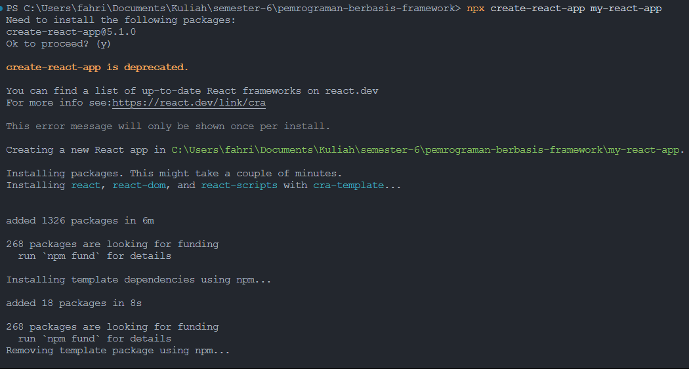
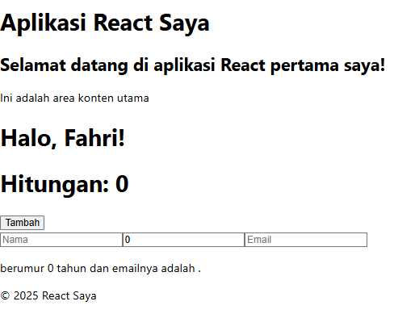
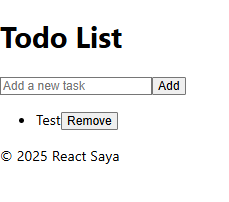

# PERTEMUAN 2 - REACTJS

> Nama: Fahridana Ahmad Rayyansyah
>
> Kelas: TI-3A
>
> Absen: 11

<hr />

## Praktikum 1: Persiapan Lingkungan

1. Memeriksa versi node dan npm
   
2. Inisialisasi Proyek React
   

## Praktikum 2: Membuat Komponen React

### Membuat Komponen Sederhana

```js
import React from "react";

function Header() {
	return (
		<header>
			<h1>Aplikasi React Saya</h1>
		</header>
	);
}

function Main() {
	return (
		<main>
			<h2>Selamat datang di aplikasi React pertama saya!</h2>
			<p>Ini adalah area konten utama</p>
		</main>
	);
}

function Footer() {
	return (
		<footer>
			<p>&copy; 2025 React Saya</p>
		</footer>
	);
}

function App() {
	return (
		<div>
			<Header />
			<Main />
			<Footer />
		</div>
	);
}

export default App;
```

## Praktikum 3: Menggunakan JSX untuk Membuat Komponen Dinamis

1. Membuat komponen counter

    ```js
    import React, { useState } from "react";

    function Counter() {
    	const [count, setCount] = useState(0);

    	function handleClick() {
    		setCount(count + 1);
    	}

    	return (
    		<div>
    			<h1>Hitungan: {count}</h1>
    			<button onClick={handleClick}>Tambah</button>
    		</div>
    	);
    }

    export default Counter;
    ```

2. Menambahkan Komponen counter ke dalam komponen App

    ```js
    import Counter from "./Counter";

    function App() {
    	return (
    		<div>
    			<Header />
    			<Main />
    			<Counter />
    			<Footer />
    		</div>
    	);
    }
    ```

## Praktikum 4: Menggunakan Props untuk Mengirim Data

1. Membuat komponen Greeting.js

    ```js
    function Greeting(props) {
    	return <h1>Halo, {props.name}!</h1>;
    }

    export default Greeting;
    ```

2. Menambahkan pada App

    ```js
    import Greeting from "./Greeting";

    function App() {
    	return (
    		<div>
    			<Header />
    			<Main />
    			<Greeting name="Fahri" />
    			<Counter />
    			<Footer />
    		</div>
    	);
    }
    ```

## Praktikum 5: Menggunakan State untuk Mengelola Data

1. Membuat komponen yang mengelola state

    ```js
    import React, { useState } from "react";

    function Example() {
    	const [name, setName] = useState("");
    	const [age, setAge] = useState(0);
    	const [email, setEmail] = useState("");

    	const handleNameChange = (e) => {
    		setName(e.target.value);
    	};
    	const handleAgeChange = (e) => {
    		setAge(e.target.value);
    	};
    	const handleEmailChange = (e) => {
    		setEmail(e.target.value);
    	};

    	return (
    		<div>
    			<input
    				type="text"
    				placeholder="Nama"
    				value={name}
    				onChange={handleNameChange}
    			/>
    			<input
    				type="number"
    				placeholder="Umur"
    				value={age}
    				onChange={handleAgeChange}
    			/>
    			<input
    				type="email"
    				placeholder="Email"
    				value={email}
    				onChange={handleEmailChange}
    			/>
    			<p>
    				{name} berumur {age} tahun dan emailnya adalah {email}.
    			</p>
    		</div>
    	);
    }

    function App() {
    	return (
    		<div>
    			<Header />
    			<Main />
    			<Greeting name="Fahri" />
    			<Counter />
    			<Example />
    			<Footer />
    		</div>
    	);
    }
    ```

2. Simpan file dan tampilkan di browser

    

## Tugas

1. Buat komponen baru bernama TodoList yang menampilkan daftar tugas (todo list). Gunakan state untuk mengelola daftar tugas dan props untuk mengirim data tugas ke komponen anak.
2. Tambahkan fitur untuk menambahkan tugas baru ke dalam daftar menggunakan form input.
3. Implementasikan fitur untuk menghapus tugas dari daftar.

**Jawab**

1. Membuat Komponen TodoList

```js
import React, { useState } from "react";

function TodoList() {
	const [todos, setTodos] = useState([]);
	const [newTodo, setNewTodo] = useState("");

	const addTodo = () => {
		if (newTodo.trim() !== "") {
			setTodos([...todos, { id: Date.now(), text: newTodo }]);
			setNewTodo("");
		}
	};

	const removeTodo = (id) => {
		setTodos(todos.filter((todo) => todo.id !== id));
	};

	return (
		<div>
			<h1>Todo List</h1>
			<input
				type="text"
				value={newTodo}
				onChange={(e) => setNewTodo(e.target.value)}
				placeholder="Add a new task"
			/>
			<button onClick={addTodo}>Add</button>
			<ul>
				{todos.map((todo) => (
					<TodoItem
						key={todo.id}
						todo={todo}
						removeTodo={removeTodo}
					/>
				))}
			</ul>
		</div>
	);
}

function TodoItem({ todo, removeTodo }) {
	return (
		<li>
			{todo.text}
			<button onClick={() => removeTodo(todo.id)}>Remove</button>
		</li>
	);
}

export default TodoList;
```

2. Menambahkan komponen tersebut di app.js

    ```js
    import TodoList from "./TodoList";

    function App() {
    	return (
    		<div>
    			<Header />
    			<Main />
    			<Greeting name="Fahri" />
    			<Counter />
    			<Example />
    			<TodoList />
    			<Footer />
    		</div>
    	);
    }
    ```

3. Output

    
