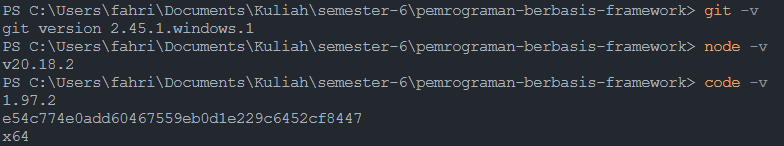

# PERTEMUAN 1 - PENGANTAR PEMROGRAMAN BERBASIS FRAMEWORK DAN REACTJS

> Nama: Fahridana Ahmad Rayyansyah
>
> Kelas: TI-3A
>
> Absen: 11

## Praktikum 1: Menyiapkan Lingkungan Pengembangan

### Pertanyaan Praktikum 1

1. Jelaskan kegunaan masing-masing dari Git, VS Code dan NodeJS yang telah Anda install pada sesi praktikum ini!  
   **Jawab**

    > #### Git
    >
    > Git adalah sistem kontrol versi (VCS) terdistribusi yang digunakan untuk melacak perubahan kode dalam pengembangan perangkat lunak.   **Kegunaan utama:**  
    >
    > - Versi Kontrol → Melacak setiap perubahan kode dan memungkinkan rollback ke versi sebelumnya.
    > - Kolaborasi Tim → Memungkinkan banyak pengembang bekerja pada satu proyek secara bersamaan tanpa konflik kode.
    > - Branching & Merging → Membantu dalam pengembangan fitur secara terpisah tanpa mengganggu kode utama.
    > - Integrasi dengan Platform → Bekerja dengan layanan seperti GitHub, GitLab, dan Bitbucket untuk penyimpanan dan kolaborasi.
    >
    > #### VSCode (Visual Studio Code)
    >
    > VS Code adalah code editor yang ringan dan kuat, dikembangkan oleh Microsoft, dengan dukungan banyak bahasa pemrograman.
    > **Kegunaan utama:**
    >
    > - Editing Kode dengan Fitur Pintar → Menyediakan fitur auto-complete, debugging, dan IntelliSense.
    > - Dukungan Ekstensi → Bisa diperluas dengan berbagai ekstensi seperti Prettier, ESLint, dan GitLens.
    > - Terminal Terintegrasi → Bisa menjalankan perintah terminal langsung dari dalam editor.
    > - Git Integration → Mempermudah commit, push, dan pull dari repositori Git langsung dari editor.
    > - Multi-language Support → Mendukung berbagai bahasa seperti JavaScript, Python, PHP, Go, dll.
    >
    > #### Node.js
    >
    > Node.js adalah runtime JavaScript yang berjalan di sisi server, dibangun di atas mesin V8 milik Google Chrome.
    > **Kegunaan utama:**
    >
    > - Menjalankan JavaScript di Server → Memungkinkan JavaScript berjalan di backend, bukan hanya di browser.
    > - Membangun API & Web Server → Mempermudah pengembangan API RESTful dengan framework seperti Express.js.
    > - Asynchronous & Event-Driven → Cocok untuk aplikasi real-time seperti chat dan streaming.
    > - NPM (Node Package Manager) → Memudahkan manajemen dependensi dan pustaka pihak ketiga.
    > - Full-Stack JavaScript → Bisa digunakan untuk pengembangan full-stack dengan kombinasi frontend (React, Vue, Next.js) dan backend (Express, NestJS).

2. Buktikan dengan screenshoot yang menunjukkan bahwa masing-masing tools tersebut telah berhasil terinstall di perangkat Anda!  
   **Jawab:**
    > 
